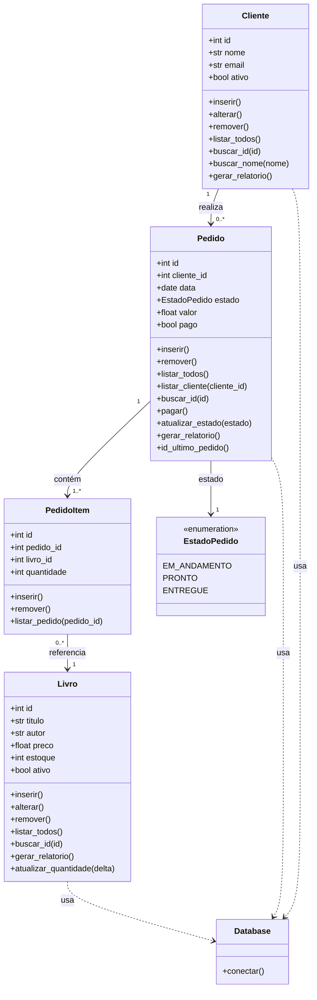

# Sistema de Livraria

Este projeto foi desenvolvido para a disciplina de Banco de Dados I, ministrada por Marcelo Iury na UFPB.
A aplicação é um sistema de vendas de uma livraria.

## Configurações iniciais

A aplicação utiliza psql, uv e Docker.
Crie uma imagem no Docker com postgres:

```bash
sudo docker run --name <nome-do-container> -e POSTGRES_PASSWORD=<sua-senha> -p 5432:5432 -d postgres
```

Crie um Database no Postgres através do Docker:

```bash
sudo docker exec -it <nome-do-container> psql -U postgres -c "CREATE DATABASE <nome-do-database>;"
```

Inicialize o banco de dados com o schema.sql através do Docker e instale as dependências com o uv:

```bash
sudo docker exec -i <nome-do-container> psql -U postgres -d <nome-do-database> < app/sql/schema.sql

uv sync
```

Rode a aplicação:

```bash
uv run python app/main.py
```

## Modelagem — Diagrama UML de Classes



Parte 2

Especificações:
O objetivo deste estender o sistema anterior para incorporar um módulo de vendas é projetar um
sistema de vendas. Na parte 1, foi abordado o crud de uma entidade cliente/estoque/venda. Na parte
2, será necessário ter todas as entidades e relacionamentos de um sistema de vendas.
Um cliente pode realizar várias compras no sistema. E cada compra possui um ou mais itens. Para
navegar no sistema não é necessário fazer compra ou está logado. Mas na hora de realizar uma
compra devem ser informados os dados do cliente.
Um cliente deve poder verificar o seus dados cadastrais como também os pedidos já realizados.
Uma compra é efetivada sempre por um vendedor. E possui uma forma de pagamento associada. Se
for cartão, boleto, pix ou berries, o pagamento tem um status de confirmação associado.
Clientes que torcem flamengo, assistem one piece e/ou são de sousa possuem desconto nas
compras.
Caso o produto não tenha mais estoque, uma compra não deve ser efetivada.
Deve ser possivel verificar produtos por nome, faixa de preço, categoria e se foram fabricados em
Mari. Caso seja um funcionário usando o sistema, ele deve poder filtrar pelos produtos que possuem
menos que 5 unidades disponíveis.
Deve ser emitido mensalmente um relatório com as vendas de cada vendedor
Devem haver pelo menos uma view e uma stored procedure. Também devem ser criados índices e
restrições de integridade referencial para as tabelas.
Não há nenhuma imposição em relação à plataforma de implementação dos projetos, nem mesmo
do modelo de Banco de Dados a ser utilizado. A escolha de uma plataforma adequada ao problema
a ser resolvido faz parte do trabalho da disciplina.
Pode usar qualquer SGBD que você quiser, desde que esteja instalado nos laboratórios do CI.
Outros SGBDs podem também ser utilizados se você conseguir autorização para instalá-lo no CI ou
se você dispuser de um Laptop e puder trazê-lo para fazer a apresentação do projeto. Ou rodá-lo por
meio de um ambiente em nuvem.
Pode usar qualquer linguagem de programação que você quiser, desde que esteja instalado nos
laboratórios do CI. Outras linguagens podem também ser utilizados se você conseguir autorização
para instalá-lo no CI ou se você dispuser de um Laptop e puder trazê-lo para fazer a apresentação do
projeto. Ou rodá-lo por meio de um ambiente em nuvem.

É necessário que tenha interface gráfica e deve ser uma aplicação pronta para uso. A interface
gráfica pode ser em console, web, desktop ou app. Escolha aquela que possui maior familiaridade.

## Como Executar a Aplicação

Para iniciar a aplicação, execute o script `run.bat`. No terminal PowerShell, use o seguinte comando a partir da pasta raiz do projeto:

```powershell
.\\run.bat
```

## Como Rodar os Testes

Para executar a suíte de testes automatizados, execute o script `test.bat`. No terminal PowerShell, use o seguinte comando a partir da pasta raiz do projeto:

```powershell
.\\test.bat
```