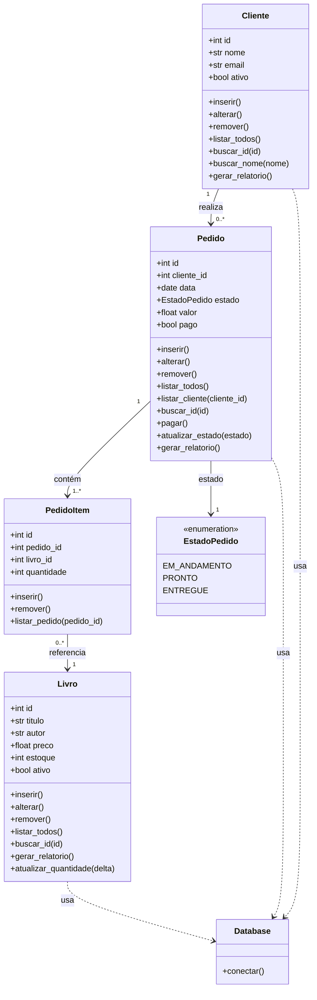

# Sistema de Livraria

Este projeto foi desenvolvido para a disciplina de Banco de Dados I, ministrada por Marcelo Iury na UFPB.
A aplicação é um sistema de vendas de uma livraria.

## Configurações iniciais

A aplicação utiliza psql, uv e Docker.
Crie uma imagem no Docker com postgres:

```bash
sudo docker run --name <nome-do-container> -e POSTGRES_PASSWORD=<sua-senha> -p 5432:5432 -d postgres
```

Crie um Database no Postgres através do Docker:

```bash
sudo docker exec -it <nome-do-container> psql -U postgres -c "CREATE DATABASE <nome-do-database>;"
```

Inicialize o banco de dados com o schema.sql através do Docker e instale as dependências com o uv:

```bash
sudo docker exec -i <nome-do-container> psql -U postgres -d <nome-do-database> < app/sql/schema.sql

uv sync
```

Rode a aplicação:

```bash
uv run python app/main.py
```

## Modelagem — Diagrama UML de Classes


