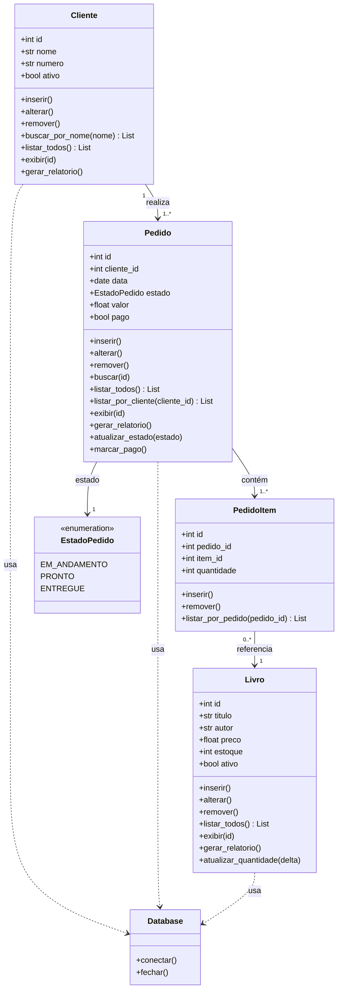

# Sistema de Livraria

Este projeto foi desenvolvido para a disciplina de Banco de Dados I, ministrada por Marcelo Iury na UFPB.
A aplicação é um sistema de vendas de uma livraria.

## Configurações iniciais

A aplicação utiliza psql, uv e Docker.
Crie um Database no Postgres através do Docker:

```bash
sudo docker exec -it meu-postgres psql -U postgres

# Executar comando no docker
postgres#= CREATE DATABASE livraria-db

# Sair
postgres#= \q
```

Inicialize o banco de dados com o schema.sql através do Docker e instale as dependências com o uv:

```bash
sudo docker exec -i meu-postgres psql -U postgres -d livraria_testes < app/sql/schema.sql

uv sync
```

Rode a aplicação:

```bash
uv run python app/main.py
```

## Modelagem — Diagrama UML de Classes


